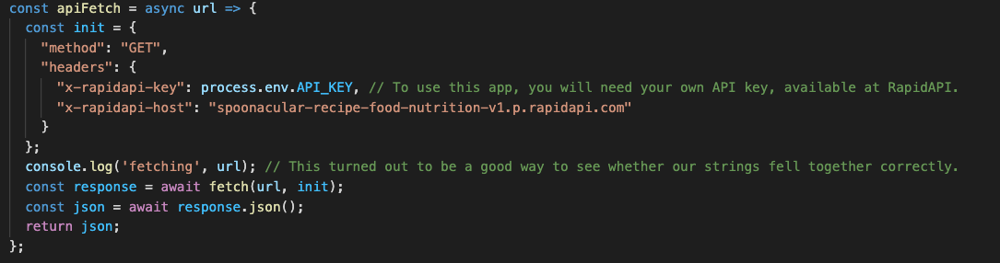
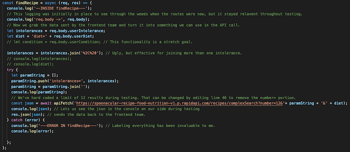

# The Healthful Pantry (Backend)

A rather simple backend for a rather complicated frontend. 

[See project frontend here.](https://github.com/charlenebatiste/the-healthful-pantry/tree/main/src)

## Table of Contents

- [General Info](##general-info)
- [Tech Stack](##tech-stack)
- [Setup](##setup)
- [Notable Code](##notable-code)
- [Status](##status)
- [Build Team](##build-team)

## General Info
The Healthful Pantry is a full stack application built by software engineering students at General Assembly. Our goal was to create an app where patients or caregivers could enter health criteria and receive recipes tailored to their health needs. 

## Tech Stack
- [Spoonacular API](https://rapidapi.com/spoonacular/api/recipe-food-nutrition/)
- [Fetch](https://developer.mozilla.org/en-US/docs/Web/API/Fetch_API/Using_Fetch)
- [Express](https://expressjs.com/)
- [MongoDB](https://docs.mongodb.com/manual/)
- [Mongoose](https://mongoosejs.com/docs/api.html)
- [bcrypt](https://www.npmjs.com/package/bcrypt)
- [Passport](http://www.passportjs.org/)
- [JSON Web Tokens](https://jwt.io/)
- [Cross Origin Resource Sharing](https://developer.mozilla.org/en-US/docs/Web/HTTP/CORS)

## Setup
1. Fork and clone this repository.
2. Fork and clone the [frontend repository](https://github.com/charlenebatiste/the-healthful-pantry/tree/main/src).
3. Run `npm install` on each to install dependencies.
4. Visit [RapidAPI](https://rapidapi.com/spoonacular/api/recipe-food-nutrition/) to obtain an API key.
5. Create a `.env` file to store environment variables. To work seamlessly, add the following keys with your own values: 
    - `API_KEY` 
    - `REACT_APP_SERVER_URL`
    - `JWT_SECRET`
    - `PORT` 
6. Run `npm start` on both the frontend and backend. 
7. Debug, because no matter how beautifully it works in this moment, it will need more debugging. 

## Notable Code

## Status
In progress.

## Build Team
- [Amanda Posey](https://github.com/amanda-posey)
- [Avery Wood](https://github.com/ga-avery)
- [Brianna Giorgi](https://github.com/bgiorgi1)
- [Charlene Batiste](https://github.com/charlenebatiste)

